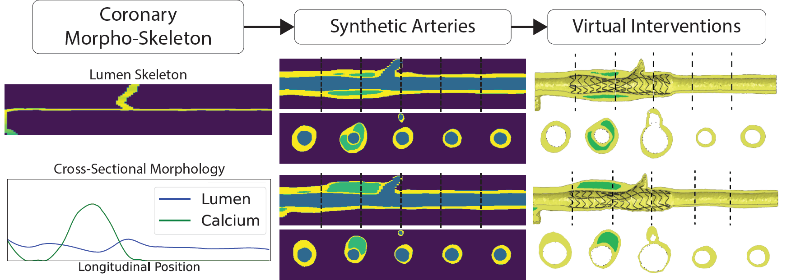
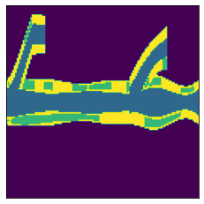

# Morpho-Skeletal Diffusion Models for Simulation Ready Anatomy

This repository contains the official implementation of
[**MorphoSkeletal Diffusion Models**](https://arxiv.org/abs/2407.15631) by
[Karim Kadry](mailto:kkadry@mit.edu), Shreya Gupta, Jonas Sogbadji, Michiel Schaap, Kersten Petersen, Takuya Mizukami, Carlos Collet, Farhad R. Nezami, Elazer R. Edelman,
published at ECCV 2024.



## Abstract

Virtual interventions enable the physics-based simulation of device deployment within coronary arteries. This framework allows for counterfactual reasoning by deploying the same device in different arterial anatomies. However, current methods to create such counterfactual arteries face a trade-off between controllability and realism. In this study, we investigate how Latent Diffusion Models (LDMs) can custom synthesize coronary anatomy for virtual intervention studies based on mid-level anatomic constraints such as topological validity, local morphological shape, and global skeletal structure. We also extend diffusion model guidance strategies to the context of morpho-skeletal conditioning and propose a novel guidance method for continuous attributes that adaptively updates the negative guiding condition throughout sampling. Our framework enables the generation and editing of coronary anatomy in a controllable manner, allowing device designers to derive mechanistic insights regarding anatomic variation and simulated device deployment.

## Getting started

Clone the repository.

```bash
git clone https://github.com/kkadry/Morphoskel-Diffusion
```

Create the conda environment from inside the checked-out repository. 

```bash
cd MorphoSkel-Diffusion
conda env create -f environment.yml -n Morphoskel_Diffusion
conda activate Morphoskel_Diffusion
```

## Running experiments


### Toy dataset

Due to privacy constraints, the data used for the original study cannot be released. We instead provide a toy coronary segmentation generator that replicates the main characteristics of our original dataset. Each toy coronary artery label map consists of a central branch with random morphological parameters for every cross section. These parameters include lumen size, vessel wall thickness, calcium thickness, and calcium arclength. Each coronary artery will have a random number of bifrucations which branch off the main artery at randomized longitudinal locations.
```bash
cd data/seeds
curl -L -o toy_labelmap.pth "https://zenodo.org/records/13984580/files/toy_labelmap.pth?download=1"
```
To visualize the toy labelmap:
```python 
import torch
from matplotlib import pyplot as plt

x=torch.load('data/seeds/toy_labelmap.pth').cpu()
plt.imshow(x[0,:,64,:].argmax(0))
plt.xticks([])
plt.yticks([])
plt.show()
```


### Model Weights
We provide pretrained weights for the VAE, diffusion model, and regressor at the following Zenodo [link](https://zenodo.org/records/13984580). Place the tar file in the `checkpoints` directory and unzip it in the following manner.

```bash
cd checkpoints
curl -L -o checkpoints.tar "https://zenodo.org/records/13984580/files/checkpoints.tar?download=1"
tar -xf checkpoints.tar
``` 

### Stage 1 Training: Variational Autoencoder
The VAE is used to encode the multi-label 3D volume into a latent space.
```bash
python train_model.py -cn train_model \
    experiment=autoencoder/coronary_toy_autoencoder \
    autoencoder_checkpoint.path_save=VAE_toy_ckpt.pth 
```
### Stage 2 Training: Diffusion Model
The diffusion model is trained in the 3D latent space of the VAE.
```bash
python train_model.py -cn train_model \
    experiment=diffusion/coronary_toy_diffusion \
    autoencoder_checkpoint.path=VAE_toy_ckpt_pretrained.pth \
    diffusion_checkpoint.path_save=diffusion_toy_ckpt.pth
```
> **Note:** We use a pretrained VAE checkpoint for this example. If you want to use your VAE from stage 1, simply change the `autoencoder_checkpoint.path` to point to your trained checkpoint.

### Stage 3 (Optional) Training: Neural Regressor
The regressor is trained to predict the morpho-skeletal encodings from the multi-label 3D volume. It can be used to guide the sampling process during loss-based guidance.
```bash
python train_model.py -cn train_model \
    experiment=regressor/coronary_toy_regressor \
    regressor_checkpoint.path_save=regressor_toy_ckpt.pth
```

### Evaluating the performance of the diffusion model
Evaluation is done by examining the morphological characteristics of the generated samples.
Morphological evaluation is done by comparing the distribution of morphological attributes (measured by the AnatomyLogger) against that of the validation set. More specifically, we compute frechet distance in morphological space, as well as improved precision and recall. 

To create the real-data metrics for evaluation
```bash
python compute_real_metrics.py -cn compute_real_metrics \
    real_metrics_fname=coronary_log_toy
```

Then, sample 50 synthetic samples from the diffusion model. The inputs to the diffusion model consist of the morphological and skeletal encodings from the label maps in the validation set.
```bash
python sample.py -cn sample \
    experiment=sampling/coronary_toy_sampling \
    sampling.n_samples=50 \
    autoencoder_checkpoint.path=VAE_toy_ckpt_pretrained.pth \
    diffusion_checkpoint.path=diffusion_toy_ckpt_pretrained.pth \
    metrics_fname=sampling_metrics_toy_base
```

Guidance can be used to increase conditional fidelity as follows:
```bash
python sample.py -cn sample \
    experiment=sampling/coronary_toy_sampling \
    guidance=coronary_adaptive_morph \
    sampling.n_samples=2 \
    metrics_fname=sampling_metrics_toy_guided
```

### Conditional editing of a patient-specific coronary arteries
To conduct virtual shape editing, three components must be specified:

1. The patient-specific label map to be edited (which we call a seed volume). 
2. A mask embedder that returns an inpainting mask for the model to use. The default mask embedder returns None.
3. A diffuse-denoise parameter (psi) which controls the noise added before denoising (which we term perturbational editing). The default value is set to 1.0 (unconditional sampling)

We provide a toy seed volume at the Zenodo [link](https://zenodo.org/records/13984580). To run the following examples, place the `toy_labelmap.pth` file in the `data/seeds` directory.
```bash
cd data/seeds
curl -L -o toy_labelmap.pth "https://zenodo.org/records/13984580/files/toy_labelmap.pth?download=1"
```

To do tissue-wise editing
```bash
python sample.py -cn sample \
    experiment=sampling/coronary_toy_sampling \
    data=coronary_toy_seed \
    mask=coronary_mask_tissue \
    sampling.n_samples=1 \
    metrics_fname=editing_metrics_toy_tissue
```

To do bounding-box editing
```bash
python sample.py -cn sample \
    experiment=sampling/coronary_toy_sampling \
    data=coronary_toy_seed \
    mask=coronary_mask_bbox \
    sampling.n_samples=1 \
    metrics_fname=editing_metrics_toy_bbox
```

To do perturbational (diffuse-denoise) editing with psi=0.3
```bash
python sample.py -cn sample \
    experiment=sampling/coronary_toy_sampling \
    data=coronary_toy_seed \
    sampling.psi=0.3 \
    sampling.n_samples=1 \
    metrics_fname=editing_metrics_toy_psi
```


## Adapting MorphoSkel-Diffusion to your own data

To adapt MorphoSkel-Diffusion to your own data, you'll need to implement at least two key components:

1. **Dataloaders**: This component should provide 3D multi-label tensors of shape (B, C, H, W, D) representing your anatomy. We recommend using the [TorchIO library](https://torchio.readthedocs.io/) for this purpose. We implement example dataloaders for this purpose in `src/data/datamodules.py`.

2. **Anatomic Encoders**: These process the anatomic label maps and output a dictionary of encodings that condition the diffusion model. 

### Anatomic Encoders
In the following, we will go into more detail on the conventions used in this code base for the anatomic encoders and how to build your own.
The overall structure of an anatomic encoder is as follows:
```text
Anatomic Encoder
├── Morph Encoder 
│   ├── Morph Embedder 1
│   │   └── Tensor Embedder 1
│   ├── Morph Embedder 2
│   │   └── Tensor Embedder 2
│   └── ...
├── Skel Encoder
│   ├── Skel Embedder 1
│   │   └── Tensor Embedder 1
│   ├── Skel Embedder 2
│   │   └── Tensor Embedder 2
│   └── ...
└── Topo Encoder
    ├── Topo Embedder 1
    │   └── Tensor Embedder 1
    ├── Topo Embedder 2
    │   └── Tensor Embedder 2
    └── ...
```

**Tensor Embedders**: The `TensorEmbedder` class takes as input anatomic metrics of varying dimensionality such as morphological vectors, pointclouds, and 3D volumes and outputs a `torch.Tensor` of certain shape. Tensor embedders can also pre/post-process the input data in terms of smoothing and resizing.

For example, to instantiate a Scalar2VoxelEmbedder class:
```python
import torch
from src.conditioning.tensor_embedders import Scalar2VoxelEmbedder


tensor_embedder = Scalar2VoxelEmbedder(emb_vox_shape=(32, 32, 32))
x = torch.randint(
    0, 2, (4, 1), dtype=torch.float
)  # torch.Size([4, 1]) with values 0 or 1
out = tensor_embedder(x) # torch.Size([4, 1, 32, 32, 32])
```

**Anatomic Embedders**: The `AnatomicEmbModel` class has a `compute_metric` method that takes as input the anatomic label map and outputs a `torch.Tensor` of certain shape. The `forward` method calculates the metric, normalizes the output if metric statistics are provided and then uses the tensor embedder to return a processed tensor of the correct shape. Each anatomic embedder has a `log_metric` method that returns an `xr.Dataset` of the computed metrics, as well as a `compute_cond_loss` method that computes a conditional loss between a sample and a seed.

For example, to instantiate a volume embedder for a 3D segmentation:

```python
from src.conditioning.morph_embedders import VolEmbedder3D


tensor_embedder = Scalar2VoxelEmbedder(emb_vox_shape=(32, 32, 32))
# Meta data for the metrics for evaluation
logging = {
    "attributes": {"metric_type": "morph", "metric_name": "vol", "metric_dim": 1},
    "dim_tags": ["n"],
    "tissue_keys": ["channel_0", "channel_1"],
}

# Training parameters
training = {"is_trainable": False, "ucg_rate": 0.0, "input_key": "x"}
# Instantiating a volume embedder
volume_embedder_1 = VolEmbedder3D(
    tensor_embedder=tensor_embedder,
    channels=[0],
    metric_min=[0],
    metric_max=[100],
    logging=logging,
    training=training,
)
x = torch.randint(
    0, 2, (4, 2, 128, 128, 128), dtype=torch.float
)  # torch.Size([4, 2, 128, 128, 128])
out = volume_embedder_1(x)
print(out.shape)  # torch.Size([4, 1, 32, 32, 32])
# Alternatively, you can log the metric directly as an xarray dataset
out_log = volume_embedder_1.log_metric(x, normalize=False)
""" Data Variables:
channel_0_vol  (n) float32 16B 49.93 49.94 49.93 50.0
"""
```

**Anatomic Encoders and Encodings**:
Anatomic encoders contain morphological, skeletal, and topological encoders, which are all instances of the `GeneralEncoder` class. The morphological, skeletal, and topological encoders are all individually optional. Only one general encoder is required at minimum. Each general encoder consists of several anatomic embedders, where the output from each embedder is concatenated along the appropriate dimension. Each general encoder outputs a dictionary of encodings consisting of 'morph_encoding', 'skel_encoding', 'topo_encoding', and 'anatomic_encoding'. 'anatomic_encoding' is a combination of the other three encodings and should be used for conditioning the model. Each individual encoding dict consists of 'concat' (Volumes of shape B,C,H,W,D), 'crossattn' (Sequences of shape B,N,C), and 'vector' (Vectors of shape B,C) elements.

For example, to instantiate a simple anatomic encoder with a morphological encoder consisting of two volume embedders:

```python
from src.conditioning.encoders import AnatomicEncoder, MorphologicalEncoder
from src.conditioning.tensor_embedders import IdentityEmbedder

# This tensor embedder does not resize the anatomic embedder output
tensor_embedder_2 = IdentityEmbedder()
# instantiating a different volume embedder
volume_embedder_2 = VolEmbedder3D(
    tensor_embedder=tensor_embedder_2,
    channels=[1],  # We change the channel to 0
    metric_min=[0],
    metric_max=[100],
    logging=logging,
    training=training,
)
morph_emb_models = {
    "Volume_Embedder_1": volume_embedder_1,
    "Volume_Embedder_2": volume_embedder_2,
}
# Instantiating a morphological encoder
morph_encoder = MorphologicalEncoder(emb_models=morph_emb_models)
# Instantiating an anatomic encoder
anatomic_encoder = AnatomicEncoder(
    morph_encoder=morph_encoder,
    skel_encoder=None,
    topo_encoder=None,
)

out = anatomic_encoder({"x": x})
# Volume Embedder 1 embedding
print(out["anatomic_encoding"]["concat"].shape)  # torch.Size([4, 1, 32, 32, 32])
# Volume Embedder 2 embedding
print(out["anatomic_encoding"]["vector"].shape)  # torch.Size([4, 1])

# Alternatively, you can log all metrics and combine them into an xarray dataset
out_log_dataset = anatomic_encoder.log_anatomic_eval_metrics({"x": x})
print(out_log_dataset.data_vars)
""" Data Variables:
channel_0_vol   (n) float32 16B 49.93 49.94 49.93 50.0
channel_1_vol   (n) float32 16B 50.05 50.03 49.89 50.01
"""
```

**Conditioners, Loggers, and Regressors**:
Conditioners, Loggers, and Regressors are instantiations of the AnatomicEncoder class.
Conditioners are used to encode anatomic information to be used as input to the diffusion model. The main methods are `forward` and `log_anatomic_cond_metrics` which returns a dictionary of encodings for conditioning and a dictionary of conditional metrics for logging.
Loggers are used to record anatomic information for evaluation. The main method is `log_anatomic_eval_metrics` which take as input anatomic label maps and return a dictionary of eval metrics for logging.
Regressors are used to compute anatomic losses which are used to guide the sampling process or regularize autoencoder training. The main method is `forward` which takes as input a dictionary of encodings.

**Batchify**:
Occasionally an anatomic embedder will not be able to use the batching functionality of pytorch. This is when a user wants to make use of third party libraries such as skimage that don't accept batched tensors. To get around this, we use the batchify decorator to handle the application of anatomic embedders over batches/channels/spatial dimensions.
This is primarily done by using a decorated function in the `compute_metric` method and specifying a channel_dict. All class methods decorated by batchify must take `torch.Tensor` as input and output to enable concatenation of all outputs. At the moment, batchify only works when decorating class methods, not standalone functions.
For example, to batchify over over all batch indices and the first channel dimension.
```python
import numpy as np
import torch
from src.utils.encoder_utils import batchify


class ExampleEmbedder:
    @batchify
    def compute_metric(self, x_slice):
        # Do something with x_slice that requires moving into numpy
        x_slice = np.array(x_slice)  # The shape is 32x32 due to batchify decorator
        return torch.tensor(x_slice)


channels_dict = {
    0: None,  # Loop the function over all batch indices
    1: [1],  # Loop the function over channel index 1
}
x = torch.randn(3, 6, 32, 32)  # Input size torch.Size([3, 6, 32, 32])
out = ExampleEmbedder().compute_metric(
    x, channels_dict=channels_dict
)  # Output size torch.Size([3, 1, 32, 32])
```
**Guidance**:
There are two families of guidance methods we use, null-based and loss-based. Both guidance methods are implemented as wrappers around the model's call method. 

**Loss-based Guidance**:
 In loss-based guidance, implemented in the `LossGuidance` class, the diffusion model is called once via `diffusion` to compute the denoised latent. The decoded voxel is used to compute an anatomic loss through `compute_loss`. The gradient of this loss is calculated using `compute_grad`. Finally, this gradient is added to the denoised latent, scaled by the guidance weight (gamma), to produce the guided output.
 
 **Null-based Guidance**:
In null-based guidance, implemented in the `NullGuidance` class, the diffusion model is called twice via `diffusion` and `diffusion_null`. The positive condition uses the original encodings, while the negative (null) condition is calculated by `compute_null_cond`. For adaptive null guidance (e.g., `AdaptiveNullMorphGuidance`), the morphological negative condition is computed based on the mismatch between the target encoding and the encoding measured from the decoded latent prediction using `compute_adaptive_encoding`. The two outputs are then linearly combined in `compute_denoised` to form the final output based on the guidance weight. The `ClassifierFreeGuidance` class in contrast, sets the null condition to zeros.

## Repository structure


```text
MorphoSkel-Diffusion/
├── checkpoints/                        # Model checkpoints
├── configs/                            # Configuration files for experiments and models
│   ├── anatomic_encoder/               # Anatomic encoder configurations
│   ├── anatomy/                        # Anatomy-specific configurations
│   ├── autoencoder/                    # Autoencoder configurations
│   ├── data/                           # Datamodule configurations
│   ├── diffusion/                      # Diffusion model configurations
│   ├── experiment/                     # Experiment-specific configurations
│   ├── guidance/                       # Guidance configurations
│   ├── mask/                           # Mask embedder configurations
│   ├── sampling/                       # Sampling configurations
│   ├── compute_real_metrics.yaml       # Configuration for computing metrics on real data
│   ├── sample.yaml                     # Configuration for sampling from trained models
│   └── train_model.yaml                # Configuration for model training
├── data/                               # Data storage and handling
├── img/                                # Images
├── results/                            # Experiment metrics
├── src/                                # Source code for the project
│   ├── conditioning/                   # Anatomic Conditioning
│   ├── data/                           # Data handling and processing
│   ├── models/                         # Model implementations
│   ├── modules/                        # Reusable modules and components
│   ├── utils/                          # Utility functions and classes
│   └── experiment.py                   # Main experiment class
├── compute_real_metrics.py             # Script to compute metrics on real data
├── __init__.py                         # Python package initialization
├── README.md                           # Project documentation and overview
├── sample.py                           # Script for sampling from trained models
└── train_model.py                      # Main script for model training
```

## Citation

If you find our code useful, please cite:

```text
@article{kadry2024diffusion,
  title={A Diffusion Model for Simulation Ready Coronary Anatomy with Morpho-skeletal Control},
  author={Kadry, Karim and Gupta, Shreya and Sogbadji, Jonas and Schaap, Michiel and Petersen, Kersten and Mizukami, Takuya and Collet, Carlos and Nezami, Farhad R and Edelman, Elazer R},
  journal={arXiv preprint arXiv:2407.15631},
  year={2024}
}

@article{kadry2023probing,
  title={Probing the Limits and Capabilities of Diffusion Models for the Anatomic Editing of Digital Twins},
  author={Kadry, Karim and Gupta, Shreya and Nezami, Farhad R and Edelman, Elazer R},
  journal={arXiv preprint arXiv:2401.00247},
  year={2023}
}
```
